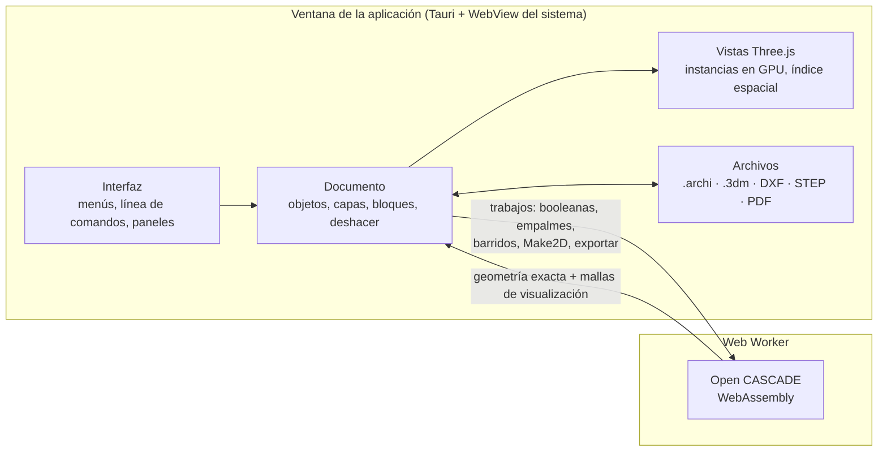

<div align="center">


# ArchiOpen

**Modelador NURBS de código abierto para arquitectura.**

Curvas, superficies y sólidos exactos, planos 2D y láminas, render, e intercambio con Rhino, STEP y
DXF, en una aplicación de escritorio ligera que se maneja con la línea de comandos.

[English](README.md) · **Español**

[](https://github.com/paugavilan8/ArchiOpen/actions/workflows/ci.yml)
[](https://github.com/paugavilan8/ArchiOpen/actions/workflows/desktop.yml)


[](LICENSE)

[Descargar](#descargar) · [Funciones](#funciones) · [Arquitectura](#arquitectura) ·
[Formatos](#formatos-de-archivo) · [Hoja de ruta](#hoja-de-ruta) · [Preguntas](#preguntas-frecuentes) · [Desarrollo](#desarrollo)

<br>


</div>

## Descripción

ArchiOpen sigue la forma de trabajar de los modeladores NURBS profesionales. Escribes un comando
(`Line`, `Loft`, `BooleanDifference`, `Make2D`…) o lo eliges en un menú o una barra de
herramientas, y el programa pide puntos, opciones y distancias. La geometría es exacta: las curvas
son NURBS y las superficies y sólidos son B-rep del núcleo
[Open CASCADE](https://dev.opencascade.org), así que lo que se exporta a Rhino o a STEP llega como
superficies, no como mallas.

**Lo más destacado**

- **Modelado:** curvas NURBS (también racionales), barridos, lofts, superficies por red de curvas,
  parches y transiciones; booleanas, empalmes y vaciados; historial de construcción que rehace las
  superficies al cambiar sus curvas.
- **Dibujo preciso:** referencias a objetos (End, Mid, Cen, Int, Perp, Tan…), coordenadas escritas,
  ortogonal, planos de construcción y gumball.
- **Planos:** `Make2D` con líneas ocultas, cotas asociativas, sombreados, tipos de línea y
  grosores, láminas con cajetín y salida a PDF vectorial y DXF.
- **Render:** materiales físicos y texturas, sol y sombras, oclusión ambiental e imágenes de hasta 4K.
- **Intercambio:** `.3dm` de Rhino con superficies exactas y bloques, STEP AP242, DXF con capas,
  bloques y cotas, STL y OBJ.
- **Rendimiento:** el núcleo geométrico trabaja en segundo plano, la selección usa un índice
  espacial y los bloques se dibujan con instancias en la GPU.

<table>
<tr>
<td width="50%"></td>
<td width="50%"></td>
</tr>
<tr>
<td align="center"><sub>Cuatro vistas, gumball y panel de propiedades</sub></td>
<td align="center"><sub>Lámina A3 con un detalle isométrico de líneas ocultas</sub></td>
</tr>
<tr>
<td colspan="2"></td>
</tr>
<tr>
<td colspan="2" align="center"><sub>Un plano de corte horizontal convierte la vista en una planta en 3D, con las secciones rellenas del color de cada material</sub></td>
</tr>
</table>

## Descargar

> [!NOTE]
> El instalador no necesita nada más: la interfaz, el núcleo geométrico y el lector de archivos de
> Rhino van dentro del ejecutable. Ver [¿Qué incluye el instalador?](#instalador)

Los instaladores se generan en GitHub Actions:

1. Abre el flujo [**Desktop app**](https://github.com/paugavilan8/ArchiOpen/actions/workflows/desktop.yml)
   en la pestaña **Actions**.
2. Pulsa **Run workflow**, o abre la última ejecución terminada.
3. Descarga el artefacto de tu sistema, por ejemplo `ArchiOpen-Windows`, que contiene los
   instaladores `.msi` y `.exe`.

Al publicar una etiqueta de versión (`git tag v0.1.0 && git push --tags`) los instaladores también
se adjuntan a un borrador de *release*.

## Funciones

Despliega cada apartado para ver los detalles.

<details>
<summary><b>Interfaz y vistas</b></summary>
<br>

- Cuatro vistas (Top, Front, Right, Perspective) con rejilla, ejes y menú propio.
- Órbita (botón derecho en Perspective), encuadre (Mayús + botón derecho o botón central) y zoom
  con la rueda.
- Modos de visualización por vista: `Wireframe`, `Shaded`, `Ghosted` (superficies translúcidas),
  `X-Ray` (las aristas ocultas se ven a través) y `Rendered`, desde el menú de la vista o con
  `SetDisplayMode`.
- `CPlane` cambia el plano de construcción de la vista activa: nuevo origen, `3Point`, `Elevation`
  o `World`. Lo que se dibuja después usa ese plano.
- `NamedView` y `NamedCPlane` guardan y recuperan vistas y planos de construcción; el panel *Views*
  los lista.
- **Planos de corte** (`ClippingPlane`, menú *View*): todo lo que queda delante del plano se oculta,
  como en una sección o una planta en 3D. La flecha indica el lado visible y `Flip` le da la vuelta.
  Los sólidos cortados se rellenan del color de su material. El plano se mueve, gira y copia como
  cualquier objeto, y el corte se actualiza en directo. En el panel de propiedades se elige en qué
  vistas corta, y `EnableClippingPlanes` / `DisableClippingPlanes` activan o quitan todos los cortes
  de la vista activa. Lo cortado no se puede seleccionar ni sirve de referencia. Los planos de
  corte también cortan los dibujos: `Make2D` (los planos activos en la vista activa, opción
  `Clipping`), los detalles de las láminas (opción *Clipping* en el panel del detalle) y las vistas
  impresas. Las líneas de corte van a su propia capa, *Make2D Section*, y se imprimen con una
  plumilla más gruesa; en plantas y secciones, las caras cortadas de los sólidos se rellenan
  (*Make2D Section Fill*, opción `SectionFill`).
- Selección por clic, ventana (de izquierda a derecha) y captura (de derecha a izquierda), con un
  índice espacial que la mantiene inmediata en modelos con miles de objetos o mallas muy densas.
- Gumball sobre la selección: flechas para mover, arcos para girar (Mayús: pasos de 15°), cajas para
  escalar en un eje (Mayús: uniforme) y el centro para mover en el plano. Un clic sin arrastrar pide
  el valor exacto.
- Capas con color, visibilidad y bloqueo; panel de propiedades del objeto seleccionado.

</details>

<details>
<summary><b>Dibujo de precisión</b></summary>
<br>

- Coordenadas escritas: absolutas `x,y,z`, relativas `r dx,dy`, y longitud fija escribiendo un
  número antes de hacer clic.
- Referencias a objetos, desde la barra de estado (F3 las activa o desactiva todas):
  - `End`, `Mid`, `Cen`, `Quad` y `Near`;
  - `Knot`: los nudos de las curvas NURBS;
  - `Int`: el cruce de dos curvas, aristas o líneas de una malla. Si se cortan de verdad el punto es
    exacto, no el de las líneas con que se dibujan; si solo se cruzan en pantalla, se toma el punto
    de la primera;
  - `Perp` y `Tan`: el punto de una curva donde la línea desde el punto anterior es perpendicular o
    tangente, exacto en rectas, arcos, círculos y NURBS.
- Ortogonal (F8) y forzado a rejilla (F9).
- Arrastrar un objeto o un punto de control seleccionado lo mueve, con referencias a objetos.
- Puntos de control: `PointsOn` (F10) y `PointsOff` (F11) en polilíneas y curvas; se seleccionan,
  arrastran, mueven con el gumball o se borran.

</details>

<details>
<summary><b>Curvas, puntos y transformaciones</b></summary>
<br>

- Dibujo: `Line`, `Polyline`, `Rectangle`, `Circle`, `Arc`, `Curve` (por puntos de control),
  `InterpCrv` (que pasa por los puntos), `Ellipse` (exacta, como curva racional), `Polygon`
  (inscrito o circunscrito) y `Helix`. Las curvas racionales se leen y escriben exactas en `.3dm`,
  DXF y el núcleo.
- Edición de curvas: `Trim`, `Split`, `Join`, `Explode`, `Offset`, `Fillet`, `FilletCorners`,
  `Chamfer`, `Extend`, `BlendCrv` (continuidad de posición, tangencia o curvatura) y `Rebuild`
  (indica cuánto se separa de la original).
- Puntos: `Point`, `Points` y `Divide` (por número de tramos o por longitud); `SelPt` los selecciona.
- Transformaciones: `Move`, `Copy`, `Rotate`, `Scale`, `Mirror`, `Array` y `ArrayPolar`, y
  herramientas para colocar objetos respecto a otros (menú *Transform*):
  - `Orient`: lleva un punto de referencia a un punto de destino y, con un segundo par, gira la
    línea de referencia sobre la de destino, también en 3D. Opciones `Copy` y `Scale` (`No`,
    `Uniform`, u `OneDirection` para estirar solo a lo largo de la línea).
  - `Orient3Pt`: coloca objetos con tres puntos de referencia sobre tres de destino (origen,
    dirección y plano) sin deformarlos.
  - `Align`: alinea objetos por sus cajas envolventes (`Left`, `Right`, `Top`, `Bottom`,
    `HorizontalCenter`, `VerticalCenter`, `Center`) entre sí o con un punto. Los grupos se mueven
    enteros.
  - `Distribute`: reparte tres o más objetos a lo largo de X, Y o Z, por centros o con huecos
    iguales, entre los dos extremos o con una separación fija.

</details>

<details>
<summary><b>Superficies, sólidos e historial</b></summary>
<br>

- Sólidos y superficies: `Box`, `Cylinder`, `Sphere`, `ExtrudeCrv` (con opción `Solid`),
  `Revolve`, `Loft`, `PlanarSrf`, `BooleanUnion`, `BooleanDifference`, `BooleanIntersection`,
  `FilletEdge`, `Sweep1`, `Shell`, `Section` y `Contour`. `Explode` separa una polisuperficie en
  caras y `Join` las vuelve a unir.
- Superficies avanzadas:
  - `Sweep2`: barre perfiles a lo largo de dos carriles, interpolando entre varios perfiles;
  - `NetworkSrf`: superficie a partir de una red de curvas en dos direcciones;
  - `Patch`: superficie ajustada a un contorno cerrado y a las curvas interiores;
  - `EdgeSrf` (de dos a cuatro curvas de borde) y `SrfPt` (de tres o cuatro esquinas);
  - `BlendSrf`: superficie de transición entre aristas de dos superficies, tangente a ambas;
  - `Pipe`: tubo a lo largo de curvas, con radio inicial y final y opción de cerrarlo como sólido.
- Edición de superficies:
  - `Split` y `Trim` funcionan con superficies, polisuperficies y sólidos, cortando con curvas
    (proyectadas tal como se ven en la vista) o con otras superficies y sólidos. Los sólidos se
    parten en sólidos.
  - `Cap`, `ExtrudeSrf`, `OffsetSrf` (con opción `Solid`) y `ExtractSrf`.
  - Curvas a partir de superficies: `Project`, `Pull`, `Intersect`, `DupBorder` y `DupEdge`.
- Historial de construcción (activo por defecto, como *Record History* de Rhino): las superficies
  hechas con `ExtrudeCrv`, `Revolve`, `Loft`, `Sweep1`, `Sweep2`, `Pipe`, `PlanarSrf`, `EdgeSrf`,
  `NetworkSrf` y `Patch` se rehacen al mover o editar sus curvas, en el mismo paso de deshacer.
  También `SelChildren`, `SelParents` y `HistoryPurge`.

</details>

<details>
<summary><b>Mallas</b></summary>
<br>

- `Mesh` convierte superficies y sólidos en mallas (`Coarse`, `Medium` o `Fine`); `MeshBox`,
  `MeshSphere`, `MeshCylinder` y `MeshPlane` crean mallas con el número de caras indicado.
- Edición: `Weld`, `Unweld`, `Flip`, `UnifyMeshNormals`, `FillMeshHoles`, `Join` y `Explode`. Los
  vértices se editan como puntos de control.
- `MeshToNURB` convierte una malla en una polisuperficie de caras planas (un sólido si es cerrada).
- Se ven suaves con aristas vivas en los pliegues; el panel de propiedades muestra vértices, caras,
  si es cerrada, área y volumen.
- `Make2D`, `Section` y `Contour` también funcionan con mallas.

</details>

<details>
<summary><b>Análisis</b></summary>
<br>

- Medición: `Distance`, `Length`, `Angle`, `Radius`, `Area` y `Volume` (con centroides). Las
  medidas de superficies y sólidos son exactas en caras planas, cilíndricas, cónicas, esféricas,
  tóricas, B-splines de grado bajo y extrusiones.
- `BoundingBox` en coordenadas del mundo o del plano de construcción.
- `CurvatureGraphOn` / `CurvatureGraphOff`: peines de curvatura que se actualizan al editar.
- Análisis `Zebra` y `DraftAngleAnalysis` en superficies y mallas; `ShowEdges` resalta los bordes
  abiertos.
- `What` describe objetos; `Check` informa de geometría no válida, aristas de más de dos caras,
  caras degeneradas y curvas sin longitud; `SelBadObjects` las selecciona.

</details>

<details>
<summary><b>Render y materiales</b></summary>
<br>

- Modo `Rendered`: materiales físicos con reflejos de un entorno de estudio, sol con sombras suaves
  y sombra sobre el suelo.
- Materiales a partir de presets (yeso, hormigón, madera, ladrillo, azulejo, mármol, acero, vidrio,
  agua…), con color, rugosidad, metal y transparencia editables, asignados a objetos o capas.
- Texturas: patrones generados (`Wood`, `Brick`, `Tiles`, `Concrete`, `Marble`) o imágenes (JPEG,
  PNG, WebP), aplicadas por proyección de caja a su tamaño real.
- `Sun`: azimut, altura, intensidad, fondo y sombras en el suelo.
- `Render` genera imágenes a 1280 × 720, 1920 × 1080, 3840 × 2160 o al tamaño de la vista, con
  suavizado y oclusión ambiental. `ViewCaptureToFile` guarda la vista tal como se ve.

</details>

<details>
<summary><b>Planos, cotas y láminas</b></summary>
<br>

- `Make2D` proyecta la selección con eliminación de líneas ocultas en curvas planas: plantas,
  alzados y axonometrías, o las cuatro vistas a la vez (`FourView`), con las líneas ocultas si se
  quiere. Con planos de corte dibuja plantas y secciones: los sólidos se cortan y el contorno del
  corte va a la capa *Make2D Section*.
- Textos y cotas con una tipografía técnica de un solo trazo: `Text`, `Dim`, `DimAligned`,
  `DimRadius`, `DimDiameter`, `DimAngle` y `Leader`, con flechas o trazos oblicuos de arquitectura.
  Las cotas se actualizan al cambiar su geometría, y su texto, altura y decimales se editan en el
  panel de propiedades.
- `Hatch` rellena curvas cerradas planas (las interiores son huecos) con un relleno sólido o un
  patrón.
- Tipos de línea y grosores por capa.
- `ExportPDF` imprime la vista activa en PDF vectorial a un tamaño de papel y una escala;
  `ExportDXF` escribe DXF R12.
- Láminas (`Layout`): vistas de detalle con su propia vista, escala y modo de dibujo (alámbrico o
  con líneas ocultas), títulos y cajetín. Las líneas ocultas solo se recalculan cuando cambia lo que
  muestra el detalle. `ExportPDF` imprime una lámina o todas en un PDF de varias páginas.

</details>

<details>
<summary><b>Bloques, grupos y organización</b></summary>
<br>

- Bloques: `Block`, `Insert`, `BlockEdit` (edición en su sitio que actualiza todas las copias,
  también las anidadas), `Explode` y `Purge`. El panel *Blocks* lista las definiciones con miniatura
  y número de copias. Las copias se dibujan con instancias en la GPU, así que cientos de copias
  cuestan casi lo mismo que una.
- Grupos: `Group`, `Ungroup`, `AddToGroup` y `RemoveFromGroup`.
- `Hide`, `Show`, `HideSwap`, `Isolate`, `Unisolate`, `Lock` y `Unlock`.
- Comandos de selección: `SelCrv`, `SelSrf`, `SelPolysrf`, `SelClosedPolysrf`, `SelOpenPolysrf`,
  `SelBlockInstance`, `SelAnnotation`, `SelDim`, `SelText`, `SelHatch`, `SelLayer`, `SelDup`,
  `SelLast`, `SelPrev` e `Invert`.
- **Copiar y pegar** (menú *Edit*): `Ctrl+C`, `Ctrl+X` y `Ctrl+V` (`CopyToClipboard`, `Cut`,
  `Paste`) pasan objetos por el portapapeles del sistema, entre ventanas y archivos, con sus capas,
  materiales, grupos y bloques. Se pegan en la misma posición y se escalan si el archivo de destino
  tiene otras unidades.

</details>

<details>
<summary><b>Archivos</b></summary>
<br>

- `.archi` (JSON) es el formato propio. La sesión se recupera sola si la aplicación se cierra de
  forma inesperada.
- **`.3dm` de Rhino** (con [rhino3dm](https://github.com/mcneel/rhino3dm)):
  - Lectura: curvas, polisuperficies, superficies y extrusiones (reconstruidas como geometría exacta
    y editable, con recortes y agujeros), mallas, puntos, capas, unidades, bloques (también anidados
    y con polisuperficies dentro) y textos. El formato de los textos no se conserva. Los SubD, las
    cotas, las directrices y los *text dots* aún no se leen; se avisa de cuántos hay.
  - Escritura: superficies y sólidos exactos como polisuperficies recortadas de Rhino (planos,
    superficies de revolución, extrusiones y NURBS), bloques como definiciones de Rhino escritas una
    sola vez, y capas anidadas. Lo que no tiene equivalente exacto se escribe como malla y se avisa.
    Los textos y las cotas se escriben como curvas.
  - `Save` nunca sobrescribe un `.3dm` abierto: guarda un `.archi`.
- **STEP** (AP242): `ExportSTEP` escribe sólidos, superficies y curvas exactos con el nombre y el
  color de su capa y las unidades; `ImportSTEP` los añade a la capa actual, convertidos a las
  unidades del modelo.
- **DXF** (ASCII, de R12 a 2018): capas con color, tipo de línea y grosor; líneas, polilíneas con
  arcos, círculos, arcos, elipses, splines, caras 3D, textos, cotas (que siguen midiendo),
  directrices, sombreados y bloques (que siguen siendo bloques). No se leen DXF binarios ni DWG.
- Importación y exportación de **STL** y **OBJ**.

</details>

<details>
<summary><b>Otros comandos y alias</b></summary>
<br>

- `PointsOn`, `PointsOff`, `Delete`, `SelAll`, `SelNone`, `Undo`, `Redo`, `Zoom`, `MaxViewport`,
  `Snap`, `Ortho`, `Osnap`, `Units`, `New`, `Open`, `Save`, `SaveAs`, `Import`, `Export`,
  `ImportSTEP` y `ExportSTEP`.
- Alias: `M`, `RO`, `SC`, `MI`, `AR`, `AP`, `TR`, `J`, `X`, `OF`, `F`, `REC`, `A`, `U`, `Z`,
  `ZE`, `ZEA`, `ZS`, `EXT`, `REV`, `BU`, `BD`, `BI`, `FE`, `SW`, `H`, `B`, `I`, `G` y `UG`.

</details>

## Arquitectura



- **Comandos:** pequeñas funciones asíncronas que piden puntos, objetos u opciones y modifican el
  documento. Cada comando se deshace en un solo paso.
- **Documento:** las curvas son NURBS evaluadas en TypeScript. Las superficies y sólidos se guardan
  en el formato exacto de Open CASCADE, junto con una malla que solo sirve para verlos.
- **Núcleo geométrico:** las operaciones pesadas se ejecutan en un Web Worker con Open CASCADE
  compilado a WebAssembly, así que la ventana sigue respondiendo y `Esc` cancela un cálculo largo.
  Cada trabajo libera los objetos del núcleo que ha creado, y el worker se sustituye sin que se note
  si su memoria crece demasiado.
- **Vistas:** Three.js dibuja en la GPU. Una jerarquía de volúmenes envolventes de dos niveles hace
  que el clic, la selección por ventana y las referencias solo miren lo que está cerca del cursor.
- **Aplicación de escritorio:** [Tauri](https://tauri.app) empaqueta todo en un ejecutable nativo
  que usa el motor web del sistema (WebView2 en Windows), por eso el instalador ocupa decenas de
  megas y no cientos.

## Formatos de archivo

| Formato | Abrir / importar | Guardar / exportar | Notas |
| --- | :---: | :---: | --- |
| `.archi` | Sí | Sí | Formato propio (JSON): modelo, láminas, materiales e historial |
| `.3dm` de Rhino | Sí | Sí | Superficies y sólidos exactos en los dos sentidos, bloques como bloques, textos al abrir; SubD y cotas aún no se leen |
| STEP `.step` `.stp` | Sí | Sí | AP242, B-rep exacto, con capas, colores y unidades |
| DXF | Sí | Sí | ASCII R12–2018: capas, bloques, cotas, textos, sombreados |
| STL / OBJ | Sí | Sí | Mallas; las superficies se exportan trianguladas |
| PDF | — | Sí | Vectorial, con grosores y tipos de línea; láminas en varias páginas |
| PNG | — | Sí | `Render` y `ViewCaptureToFile` |

## Hoja de ruta

- [x] Referencias `Int`, `Perp`, `Tan` y `Knot`
- [x] Planos de corte en directo con secciones rellenas
- [x] Planos de corte en láminas, `Make2D` y PDF
- [x] `Orient`, `Orient3Pt`, `Align` y `Distribute`
- [x] Bloques y textos de `.3dm`; bloques exportados como bloques
- [ ] Cotas y SubD de `.3dm`
- [x] Copiar y pegar entre archivos
- [ ] Superficies: `FilletSrf`, `ChamferEdge`, `MatchSrf`, `RailRevolve`, `Untrim`, `UnrollSrf`
- [ ] Deformaciones: `Bend`, `Twist`, `Taper`, `Flow`, `Cage`
- [ ] Modelado SubD
- [ ] Herramientas de arquitectura: muros, forjados, huecos y niveles
- [ ] Instaladores firmados y actualizaciones automáticas

## Preguntas frecuentes

<details id="instalador">
<summary><b>¿Qué incluye el instalador?</b></summary>
<br>

Todo lo que necesita la aplicación. Tauri incluye en el ejecutable la interfaz, el núcleo Open
CASCADE (unos 23 MB de WebAssembly) y el lector de `.3dm`. Lo único externo es el motor web del
sistema: WebView2 en Windows 10 y 11, que ya viene instalado (si faltara, el instalador lo
descarga). Tus modelos son los archivos `.archi` que guardes.

</details>

<details>
<summary><b>Windows no deja abrir la aplicación</b></summary>
<br>

El ejecutable todavía no está firmado. En un ordenador personal, Windows SmartScreen puede mostrar
un aviso: pulsa *Más información* → *Ejecutar de todas formas*. En ordenadores gestionados, las
políticas como AppLocker suelen bloquear programas sin firmar instalados en la carpeta del usuario;
hace falta que un administrador lo permita.

</details>

<details>
<summary><b>¿Puedo trabajar con Rhino en los dos sentidos?</b></summary>
<br>

Sí. `Open` e `Import` leen `.3dm` con curvas, superficies, polisuperficies, extrusiones, mallas,
bloques, textos y capas, y `Export` escribe las superficies y sólidos exactos (no como mallas) y
los bloques como bloques. Lo que aún no se lee se indica al abrir el archivo, y `Save` nunca
sobrescribe el `.3dm` original.

</details>

<details>
<summary><b>¿Necesita conexión a internet?</b></summary>
<br>

No. Todo funciona sin conexión; no hay cuentas ni telemetría.

</details>

<details>
<summary><b>¿Está relacionado con Rhino o McNeel?</b></summary>
<br>

No. ArchiOpen es un proyecto independiente. Sigue la forma de trabajar y los nombres de comandos
habituales en los modeladores NURBS para resultar familiar, pero no usa código, iconos ni recursos
de ningún otro producto. Los `.3dm` se leen con [rhino3dm](https://github.com/mcneel/rhino3dm) (MIT)
y se escriben siguiendo el formato documentado en el código abierto de openNURBS.

</details>

## Desarrollo

Requisitos: Node 22 y, para la aplicación de escritorio, Rust y los
[requisitos de Tauri](https://tauri.app/start/prerequisites/) de tu sistema.

```sh
npm install
npm run dev        # interfaz en el navegador, http://localhost:5173
npm run app:dev    # aplicación de escritorio con recarga en caliente
npm run app:build  # instaladores en src-tauri/target/release/bundle
npm run typecheck
npm test           # pruebas de geometría y del núcleo
```

<details>
<summary><b>Estructura del proyecto</b></summary>
<br>

| Carpeta | Contenido |
| --- | --- |
| `src/core` | Modelo del documento, geometría (curvas, mallas, cotas, sombreados, bloques), índice de selección, referencias a objetos |
| `src/math` | NURBS: evaluación, nudos y pesos |
| `src/kernel` | Open CASCADE: carga, Web Worker, trabajos, gestión de memoria, exportación exacta a `.3dm` |
| `src/commands` | Comandos, agrupados por tema |
| `src/input` | Ratón y teclado, peticiones de puntos y referencias a objetos |
| `src/view` | Vistas Three.js, gumball, modos de visualización, render, planos de corte |
| `src/io` | `.archi`, `.3dm`, DXF, STEP, STL, OBJ, PDF y láminas |
| `src/ui` | Menús, barras de herramientas, paneles y línea de comandos |
| `src-tauri` | Aplicación de escritorio |

</details>

## Créditos

- [Open CASCADE Technology](https://dev.opencascade.org) (LGPL 2.1 con excepción) a través de
  [replicad](https://replicad.xyz) (MIT), [Three.js](https://threejs.org) (MIT),
  [rhino3dm](https://github.com/mcneel/rhino3dm) (MIT) y [Tauri](https://tauri.app)
  (MIT/Apache 2.0).
- El archivo de prueba `src/io/fixtures/rhino-text.3dm.b64` contiene dos textos de los modelos de
  prueba de [rhino3dm](https://github.com/mcneel/rhino3dm) (MIT).
- El archivo de prueba `src/io/fixtures/ezdxf-sample.dxf` está generado con
  [ezdxf](https://github.com/mozman/ezdxf) (MIT).
- Los textos se dibujan con las fuentes Hershey (A. V. Hershey, U.S. National Bureau of Standards),
  en la conversión de [hersheytext](https://github.com/techninja/hersheytextjs) (MIT).

## Licencia

ArchiOpen se distribuye bajo la [licencia MIT](LICENSE). Las bibliotecas de terceros mantienen sus
propias licencias; ver [Créditos](#créditos).
