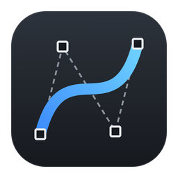
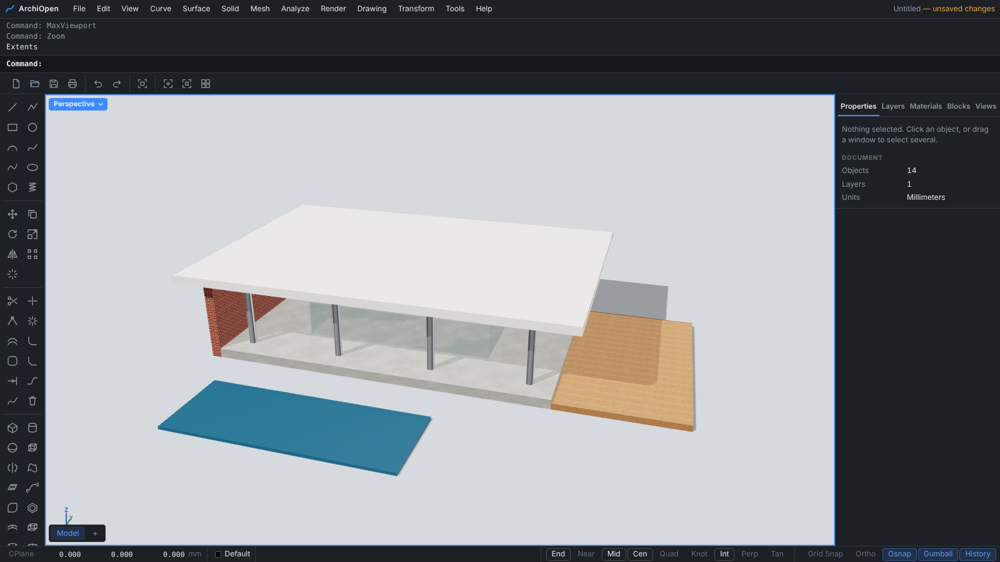
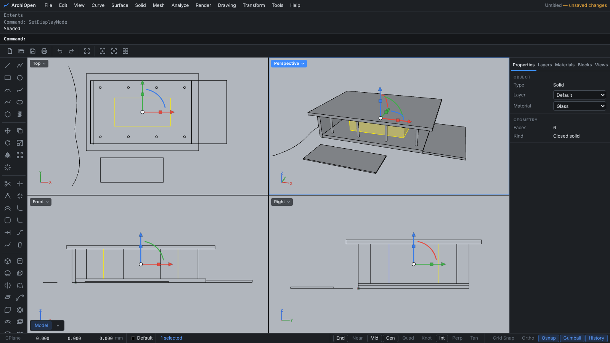
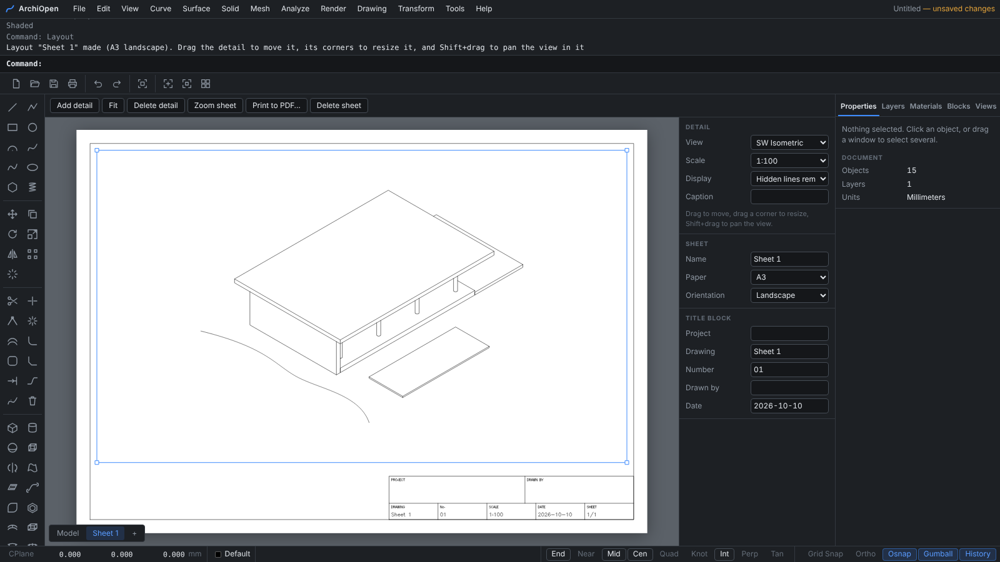
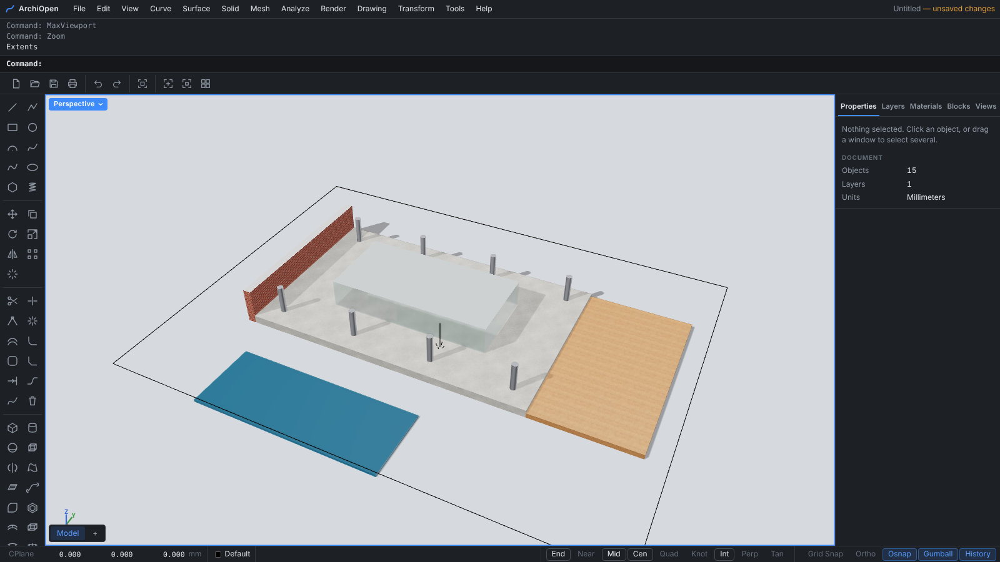
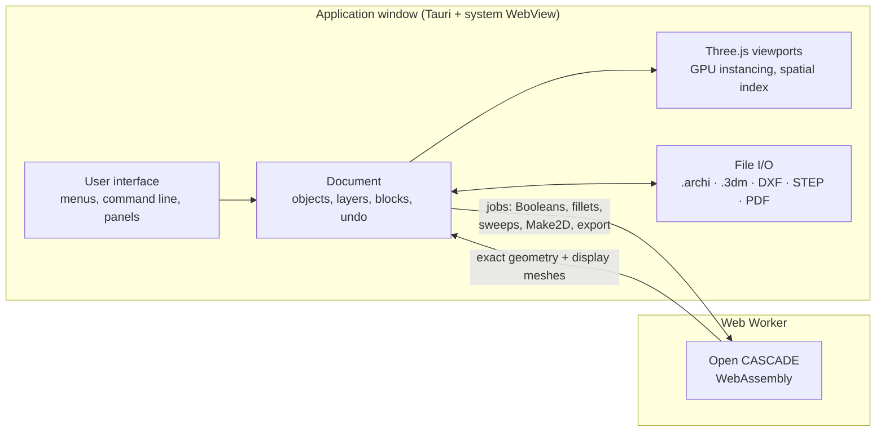

<div align="center">



# ArchiOpen

**An open-source NURBS modeler for architecture.**

Exact curves, surfaces and solids, 2D drawings and layout sheets, rendering, and Rhino, STEP and DXF
interoperability, in a lightweight desktop application driven by a command line.

**English** · [Español](README.es.md)

[](https://github.com/paugavilan8/ArchiOpen/actions/workflows/ci.yml)
[](https://github.com/paugavilan8/ArchiOpen/actions/workflows/desktop.yml)


[](LICENSE)

[Download](#download) · [Features](#features) · [Architecture](#architecture) ·
[File formats](#file-formats) · [Roadmap](#roadmap) · [FAQ](#faq) · [Development](#development)

<br>



</div>

## Overview

ArchiOpen follows the workflow of professional NURBS modelers. You type a command (`Line`, `Loft`,
`BooleanDifference`, `Make2D`, …) or pick it from a menu or toolbar, and the program prompts for
points, options and distances. Geometry is exact: curves are NURBS, and surfaces and solids are
boundary representations from the [Open CASCADE](https://dev.opencascade.org) kernel. Models
exported to Rhino or STEP therefore arrive as surfaces, not meshes.

**Highlights**

- **Modeling:** NURBS curves (rational included), sweeps, lofts, network surfaces, patches and
  blends; Boolean operations, fillets and shells; construction history that rebuilds surfaces when
  their input curves change.
- **Precision drafting:** object snaps (End, Mid, Cen, Int, Perp, Tan, …), typed coordinates,
  ortho, construction planes and a gumball.
- **Drawings:** hidden-line `Make2D`, associative dimensions, hatches, linetypes and print widths,
  layout sheets with title blocks, vector PDF and DXF output.
- **Rendering:** physically based materials and textures, sun and shadows, ambient occlusion, and
  images up to 4K.
- **Interoperability:** Rhino `.3dm` with exact surfaces and blocks, STEP AP242, DXF with layers,
  blocks and dimensions, STL and OBJ.
- **Performance:** the geometry kernel runs in a background worker, picking uses a spatial index,
  and block instances are drawn with GPU instancing.

<table>
<tr>
<td width="50%"></td>
<td width="50%"></td>
</tr>
<tr>
<td align="center"><sub>Four viewports, gumball and properties panel</sub></td>
<td align="center"><sub>A3 layout sheet with a hidden-line isometric detail</sub></td>
</tr>
<tr>
<td colspan="2"></td>
</tr>
<tr>
<td colspan="2" align="center"><sub>A horizontal clipping plane turns the view into a 3D floor plan, with sections filled in each material's color</sub></td>
</tr>
</table>

## Download

> [!NOTE]
> The installer is self-contained: the user interface, the geometry kernel and the Rhino file
> reader are all bundled into the executable. See [What does the installer include?](#installer)

Installers are built by GitHub Actions:

1. Open the [**Desktop app**](https://github.com/paugavilan8/ArchiOpen/actions/workflows/desktop.yml)
   workflow in the **Actions** tab.
2. Click **Run workflow**, or open the latest completed run.
3. Download the artifact for your platform, for example `ArchiOpen-Windows`, which contains the
   `.msi` and `.exe` installers.

Pushing a version tag (`git tag v0.1.0 && git push --tags`) also attaches the installers to a draft
release.

## Features

Expand a section for details.

<details>
<summary><b>Interface and viewports</b></summary>
<br>

- Four viewports (Top, Front, Right, Perspective) with grid, axis gizmo and a per-viewport menu.
- Orbit (right mouse button in Perspective), pan (Shift + right button, or middle button) and
  wheel zoom.
- Display modes per viewport: `Wireframe`, `Shaded`, `Ghosted` (translucent surfaces), `X-Ray`
  (hidden edges show through) and `Rendered`, from the viewport menu or `SetDisplayMode`.
- `CPlane` sets the active viewport's construction plane: a new origin, `3Point`, `Elevation` or
  `World`. Everything drawn afterwards uses that plane.
- `NamedView` and `NamedCPlane` save and restore views and construction planes; the *Views* panel
  lists them.
- **Clipping planes** (`ClippingPlane`, *View* menu): everything in front of the plane is hidden,
  as in a section or a 3D floor plan. The arrow shows the visible side and `Flip` reverses it. Cut
  solids are capped in their material's color. Planes can be moved, rotated and copied like any
  object, and the cut updates live. Each plane can be enabled per viewport in the properties panel,
  and `EnableClippingPlanes` / `DisableClippingPlanes` toggle all planes in the active viewport.
  Geometry that is clipped away cannot be picked or snapped to. Clipping planes also cut drawings:
  `Make2D` (the planes on in the active viewport, option `Clipping`), layout details (option
  *Clipping* in the detail panel) and printed views. Cut lines go on their own layer,
  *Make2D Section*, and print with a heavier pen; in plans and sections, the cut faces of solids
  are filled (*Make2D Section Fill*, option `SectionFill`).
- Selection by click, window (left to right) and crossing (right to left), backed by a spatial
  index so it stays immediate in models with thousands of objects or very dense meshes.
- Gumball on the selection: arrows to move, arcs to rotate (Shift snaps to 15°), boxes to scale
  along one axis (Shift scales uniformly) and the center to move in the plane. Clicking a handle
  without dragging prompts for an exact value.
- Layers with color, visibility and locking; a properties panel for the selected object.

</details>

<details>
<summary><b>Precision drafting</b></summary>
<br>

- Typed coordinates: absolute `x,y,z`, relative `r dx,dy`, and a fixed length by typing a number
  before clicking.
- Object snaps, toggled from the status bar (F3 turns them all on or off):
  - `End`, `Mid`, `Cen`, `Quad` and `Near`;
  - `Knot`: the knots of NURBS curves;
  - `Int`: where two curves, edges or mesh lines cross. When they truly intersect the point is
    exact, not taken from the display polylines; when they only cross on screen, the point on the
    first one is used;
  - `Perp` and `Tan`: the point on a curve where the line from the previous point is perpendicular
    or tangent, exact on lines, arcs, circles and NURBS curves.
- Ortho (F8) and grid snap (F9).
- Dragging a selected object or control point moves it, with object snaps.
- Control points: `PointsOn` (F10) and `PointsOff` (F11) on polylines and curves; points can be
  selected, dragged, moved with the gumball or deleted.

</details>

<details>
<summary><b>Curves, points and transforms</b></summary>
<br>

- Drawing: `Line`, `Polyline`, `Rectangle`, `Circle`, `Arc`, `Curve` (control points),
  `InterpCrv` (through points), `Ellipse` (exact, as a rational curve), `Polygon` (inscribed or
  circumscribed) and `Helix`. Rational curves are read and written exactly in `.3dm`, DXF and the
  kernel.
- Curve editing: `Trim`, `Split`, `Join`, `Explode`, `Offset`, `Fillet`, `FilletCorners`,
  `Chamfer`, `Extend`, `BlendCrv` (position, tangency or curvature continuity) and `Rebuild`
  (reports the deviation from the original).
- Points: `Point`, `Points`, and `Divide` (by number of segments or by length); `SelPt` selects
  them.
- Transforms: `Move`, `Copy`, `Rotate`, `Scale`, `Mirror`, `Array` and `ArrayPolar`, plus tools to
  place objects relative to others (*Transform* menu):
  - `Orient`: moves a reference point onto a target point and, given a second pair, rotates the
    reference line onto the target line, in 3D. Options `Copy` and `Scale` (`No`, `Uniform`, or
    `OneDirection` to stretch along the line only).
  - `Orient3Pt`: places objects from three reference points onto three target points (origin,
    direction and plane) without deforming them.
  - `Align`: aligns objects by their bounding boxes (`Left`, `Right`, `Top`, `Bottom`,
    `HorizontalCenter`, `VerticalCenter`, `Center`) with each other or with a point. Groups move as
    a unit.
  - `Distribute`: spaces three or more objects along X, Y or Z by centers or by equal gaps, either
    between the outermost two or at a fixed spacing.

</details>

<details>
<summary><b>Surfaces, solids and history</b></summary>
<br>

- Solids and surfaces: `Box`, `Cylinder`, `Sphere`, `ExtrudeCrv` (with a `Solid` option),
  `Revolve`, `Loft`, `PlanarSrf`, `BooleanUnion`, `BooleanDifference`, `BooleanIntersection`,
  `FilletEdge`, `ChamferEdge`, `Sweep1`, `Shell`, `Section` and `Contour`. `Explode` splits a polysurface into
  faces and `Join` joins them again.
- Advanced surfaces:
  - `Sweep2`: sweeps profiles along two rails, interpolating between several profiles;
  - `NetworkSrf`: a surface from a network of curves in two directions;
  - `Patch`: a surface fitted to a closed boundary and the curves inside it;
  - `EdgeSrf` (from two to four edge curves) and `SrfPt` (from three or four corners);
  - `BlendSrf`: a transition surface between the edges of two surfaces, tangent to both;
  - `Pipe`: a pipe along curves, with start and end radii and an option to cap it as a solid.
- Surface editing:
  - `Split` and `Trim` work on surfaces, polysurfaces and solids, with curves (projected as seen in
    the viewport) or with other surfaces and solids. Solids split into solids.
  - `Cap`, `ExtrudeSrf`, `OffsetSrf` (with a `Solid` option) and `ExtractSrf`.
  - `UnrollSrf` flattens planar, cylindrical and conical faces into cutting patterns (outlines in
    the XY plane, with lengths preserved). Faces that share a straight edge stay joined as a folding
    net; with `Explode` every face is laid out on its own. Other faces are skipped and reported.
  - Curves from surfaces: `Project`, `Pull`, `Intersect`, `DupBorder` and `DupEdge`.
- Construction history (on by default, like Rhino's *Record History*): surfaces made with
  `ExtrudeCrv`, `Revolve`, `Loft`, `Sweep1`, `Sweep2`, `Pipe`, `PlanarSrf`, `EdgeSrf`,
  `NetworkSrf` and `Patch` rebuild when their input curves are moved or edited, in the same undo
  step. `SelChildren`, `SelParents` and `HistoryPurge` are available.

</details>

<details>
<summary><b>Meshes</b></summary>
<br>

- `Mesh` converts surfaces and solids to meshes (`Coarse`, `Medium` or `Fine`); `MeshBox`,
  `MeshSphere`, `MeshCylinder` and `MeshPlane` create meshes with a given number of faces.
- Editing: `Weld`, `Unweld`, `Flip`, `UnifyMeshNormals`, `FillMeshHoles`, `Join` and `Explode`.
  Vertices can be edited as control points.
- `MeshToNURB` converts a mesh into a polysurface of planar faces (a solid when closed).
- Meshes are shaded smoothly with sharp creases; the properties panel shows vertices, faces,
  closedness, area and volume.
- `Make2D`, `Section` and `Contour` work on meshes too.

</details>

<details>
<summary><b>Analysis</b></summary>
<br>

- Measurement: `Distance`, `Length`, `Angle`, `Radius`, `Area` and `Volume` (with centroids).
  Surface and solid measurements are exact for planar, cylindrical, conical, spherical, toroidal,
  low-degree B-spline and extruded faces.
- `BoundingBox` in world or construction-plane coordinates.
- `CurvatureGraphOn` / `CurvatureGraphOff`: curvature combs that update as curves are edited.
- `Zebra` and `DraftAngleAnalysis` shading for surfaces and meshes; `ShowEdges` highlights naked
  edges.
- `What` describes objects; `Check` reports invalid geometry, non-manifold edges, degenerate faces
  and zero-length curves; `SelBadObjects` selects them.

</details>

<details>
<summary><b>Rendering and materials</b></summary>
<br>

- `Rendered` display mode: physically based materials with studio reflections, a sun with soft
  shadows and a ground shadow under the model.
- Materials from presets (plaster, concrete, wood, brick, tiles, marble, steel, glass, water, …),
  editable color, roughness, metalness and transparency, assigned to objects or layers.
- Textures: procedural patterns (`Wood`, `Brick`, `Tiles`, `Concrete`, `Marble`) or images
  (JPEG, PNG, WebP), applied with box mapping at their real-world size.
- `Sun`: azimuth, altitude, intensity, background and ground shadows.
- `Render` produces images at 1280 × 720, 1920 × 1080, 3840 × 2160 or viewport size, with
  antialiasing and ambient occlusion. `ViewCaptureToFile` saves the viewport as displayed.

</details>

<details>
<summary><b>Drawings, dimensions and layouts</b></summary>
<br>

- `Make2D` projects the selection with hidden-line removal into flat curves: plans, elevations
  and axonometric views, or four views at once (`FourView`), optionally including hidden lines.
  With clipping planes it draws plans and sections: solids are cut and their cut outlines go on the
  *Make2D Section* layer.
- Text and dimensions drawn with a single-stroke technical font: `Text`, `Dim`, `DimAligned`,
  `DimRadius`, `DimDiameter`, `DimAngle` and `Leader`, with arrowheads or architectural ticks.
  Dimensions update when their geometry changes, and their text, height and precision are editable
  in the properties panel.
- `Hatch` fills closed planar curves (inner curves become holes) with a solid fill or a pattern.
- Linetypes and print widths per layer.
- `ExportPDF` prints the active viewport to vector PDF at a given paper size and scale;
  `ExportDXF` writes DXF R12.
- Layout sheets (`Layout`): detail views with their own view, scale and display mode (wireframe or
  hidden-line), captions and a title block. Hidden lines are recomputed only when what a detail
  shows changes. `ExportPDF` prints one sheet or all of them as a multi-page PDF.

</details>

<details>
<summary><b>Blocks, groups and organization</b></summary>
<br>

- Blocks: `Block`, `Insert`, `BlockEdit` (in-place editing that updates every instance, nested ones
  included), `Explode` and `Purge`. The *Blocks* panel lists definitions with thumbnails and
  instance counts. Instances are drawn with GPU instancing, so hundreds of copies cost about the
  same as one.
- Groups: `Group`, `Ungroup`, `AddToGroup` and `RemoveFromGroup`.
- `Hide`, `Show`, `HideSwap`, `Isolate`, `Unisolate`, `Lock` and `Unlock`.
- Selection commands: `SelCrv`, `SelSrf`, `SelPolysrf`, `SelClosedPolysrf`, `SelOpenPolysrf`,
  `SelBlockInstance`, `SelAnnotation`, `SelDim`, `SelText`, `SelHatch`, `SelLayer`, `SelDup`,
  `SelLast`, `SelPrev` and `Invert`.
- **Copy and paste** (*Edit* menu): `Ctrl+C`, `Ctrl+X` and `Ctrl+V` (`CopyToClipboard`, `Cut`,
  `Paste`) carry objects through the system clipboard, between windows and files, together with
  their layers, materials, groups and blocks. Pasted objects keep their position and are scaled
  when the target file uses different units.

</details>

<details>
<summary><b>Files</b></summary>
<br>

- `.archi` (JSON) is the native format. The session is recovered automatically if the application
  closes unexpectedly.
- **Rhino `.3dm`** (via [rhino3dm](https://github.com/mcneel/rhino3dm)):
  - Reading: curves, polysurfaces, surfaces and extrusions (rebuilt as exact, editable geometry
    with trims and holes), meshes, points, layers, units, blocks (including nested blocks and
    blocks containing polysurfaces) and text. Formatting of text is not preserved. SubD objects,
    dimensions, leaders and text dots are not read yet; the number skipped is reported.
  - Writing: surfaces and solids are exported exactly as trimmed Rhino polysurfaces (planes,
    surfaces of revolution, extrusions and NURBS), blocks as Rhino block definitions written once,
    and nested layers. Geometry without an exact equivalent is written as a mesh, and the export
    reports it. Text and dimensions are written as curves.
  - `Save` never overwrites an opened `.3dm`; it saves an `.archi` file instead.
- **STEP** (AP242): `ExportSTEP` writes exact solids, surfaces and curves with layer names, colors
  and units; `ImportSTEP` reads them into the current layer, converted to the model's units.
- **DXF** (ASCII, R12 to 2018): layers with color, linetype and lineweight; lines, polylines with
  arcs, circles, arcs, ellipses, splines, 3D faces, text, dimensions (kept associative), leaders,
  hatches and blocks (kept as blocks). Binary DXF and DWG are not supported.
- **STL** and **OBJ** import and export.

</details>

<details>
<summary><b>Other commands and aliases</b></summary>
<br>

- `PointsOn`, `PointsOff`, `Delete`, `SelAll`, `SelNone`, `Undo`, `Redo`, `Zoom`, `MaxViewport`,
  `Snap`, `Ortho`, `Osnap`, `Units`, `New`, `Open`, `Save`, `SaveAs`, `Import`, `Export`,
  `ImportSTEP` and `ExportSTEP`.
- Aliases: `M`, `RO`, `SC`, `MI`, `AR`, `AP`, `TR`, `J`, `X`, `OF`, `F`, `REC`, `A`, `U`, `Z`,
  `ZE`, `ZEA`, `ZS`, `EXT`, `REV`, `BU`, `BD`, `BI`, `FE`, `SW`, `H`, `B`, `I`, `G` and `UG`.

</details>

## Architecture



- **Commands** are small asynchronous functions that prompt for points, objects or options and
  edit the document. Each command is a single undo step.
- **Document.** Curves are NURBS evaluated in TypeScript. Surfaces and solids are stored in Open
  CASCADE's exact format, together with a mesh used only for display.
- **Geometry kernel.** Heavy operations run in a Web Worker with Open CASCADE compiled to
  WebAssembly, so the window stays responsive and `Esc` cancels a long job. Each job releases the
  kernel objects it created, and the worker is replaced transparently if its memory grows too
  large.
- **Viewports.** Three.js renders on the GPU. A two-level bounding volume hierarchy limits picking,
  window selection and object snaps to what is near the cursor.
- **Desktop application.** [Tauri](https://tauri.app) packages everything into a native executable
  that uses the system web engine (WebView2 on Windows), keeping the installer to tens of megabytes.

## File formats

| Format | Open / import | Save / export | Notes |
| --- | :---: | :---: | --- |
| `.archi` | Yes | Yes | Native JSON format: model, layouts, materials and history |
| Rhino `.3dm` | Yes | Yes | Exact surfaces and solids both ways, blocks as blocks, text on import; SubD and dimensions not read yet |
| STEP `.step` `.stp` | Yes | Yes | AP242, exact B-rep, with layers, colors and units |
| DXF | Yes | Yes | ASCII R12–2018: layers, blocks, dimensions, text, hatches |
| STL / OBJ | Yes | Yes | Meshes; surfaces are exported triangulated |
| PDF | — | Yes | Vector output with lineweights and linetypes; multi-page layouts |
| PNG | — | Yes | `Render` and `ViewCaptureToFile` |

## Roadmap

- [x] `Int`, `Perp`, `Tan` and `Knot` object snaps
- [x] Live clipping planes with filled sections
- [x] Clipping planes in layouts, `Make2D` and PDF output
- [x] `Orient`, `Orient3Pt`, `Align` and `Distribute`
- [x] Blocks and text from `.3dm`; blocks exported as blocks
- [ ] Dimensions and SubD from `.3dm`
- [x] Copy and paste between files
- [x] `ChamferEdge` and `UnrollSrf`
- [ ] Surface tools: `FilletSrf`, `MatchSrf`, `RailRevolve`, `Untrim`
- [ ] Deformation tools: `Bend`, `Twist`, `Taper`, `Flow`, `Cage`
- [ ] SubD modeling
- [ ] Architectural tools: walls, slabs, openings and levels
- [ ] Signed installers and automatic updates

## FAQ

<details id="installer">
<summary><b>What does the installer include?</b></summary>
<br>

Everything the application needs. Tauri bundles the user interface, the Open CASCADE kernel (about
23 MB of WebAssembly) and the `.3dm` reader into the executable. The only external dependency is
the system web engine: WebView2 on Windows 10 and 11, which is preinstalled (the installer
downloads it if it is missing). Your models are the `.archi` files you save.

</details>

<details>
<summary><b>Windows will not run the application</b></summary>
<br>

The executable is not code-signed yet. On a personal computer, Windows SmartScreen may show a
warning: choose *More info* → *Run anyway*. On managed computers, policies such as AppLocker often
block unsigned programs installed in the user profile; an administrator has to allow it.

</details>

<details>
<summary><b>Can I work back and forth with Rhino?</b></summary>
<br>

Yes. `Open` and `Import` read `.3dm` files with curves, surfaces, polysurfaces, extrusions,
meshes, blocks, text and layers, and `Export` writes exact surfaces and solids (not meshes) and
blocks as blocks. Anything that cannot be read yet is reported when the file is opened, and `Save`
never overwrites the original `.3dm`.

</details>

<details>
<summary><b>Does it need an internet connection?</b></summary>
<br>

No. Everything runs offline; there are no accounts and no telemetry.

</details>

<details>
<summary><b>Is ArchiOpen affiliated with Rhino or McNeel?</b></summary>
<br>

No. ArchiOpen is an independent project. It follows the workflow and command names common to NURBS
modelers so that it feels familiar, but it uses no code, icons or assets from any other product.
`.3dm` files are read with [rhino3dm](https://github.com/mcneel/rhino3dm) (MIT) and written
following the format documented in the open-source openNURBS toolkit.

</details>

## Development

Requirements: Node 22 and, for the desktop application, Rust and the
[Tauri prerequisites](https://tauri.app/start/prerequisites/) for your platform.

```sh
npm install
npm run dev        # user interface in the browser at http://localhost:5173
npm run app:dev    # desktop application with hot reload
npm run app:build  # installers in src-tauri/target/release/bundle
npm run typecheck
npm test           # geometry and kernel tests
```

<details>
<summary><b>Project structure</b></summary>
<br>

| Directory | Contents |
| --- | --- |
| `src/core` | Document model, geometry (curves, meshes, dimensions, hatches, blocks), pick index, object snaps |
| `src/math` | NURBS evaluation, knots and weights |
| `src/kernel` | Open CASCADE: loading, Web Worker, jobs, memory management, exact `.3dm` export |
| `src/commands` | Commands, grouped by topic |
| `src/input` | Mouse and keyboard handling, point requests and object snaps |
| `src/view` | Three.js viewports, gumball, display modes, rendering, clipping |
| `src/io` | `.archi`, `.3dm`, DXF, STEP, STL, OBJ, PDF and layout sheets |
| `src/ui` | Menus, toolbars, panels and command line |
| `src-tauri` | Desktop application |

</details>

## Credits

- [Open CASCADE Technology](https://dev.opencascade.org) (LGPL 2.1 with exception) through
  [replicad](https://replicad.xyz) (MIT), [Three.js](https://threejs.org) (MIT),
  [rhino3dm](https://github.com/mcneel/rhino3dm) (MIT) and [Tauri](https://tauri.app)
  (MIT/Apache 2.0).
- The test file `src/io/fixtures/rhino-text.3dm.b64` contains two text objects from the
  [rhino3dm](https://github.com/mcneel/rhino3dm) test models (MIT).
- The test file `src/io/fixtures/ezdxf-sample.dxf` was generated with
  [ezdxf](https://github.com/mozman/ezdxf) (MIT).
- Text is drawn with the Hershey fonts (A. V. Hershey, U.S. National Bureau of Standards), as
  converted by [hersheytext](https://github.com/techninja/hersheytextjs) (MIT).

## License

ArchiOpen is released under the [MIT License](LICENSE). Third-party libraries keep their own
licenses; see [Credits](#credits).
