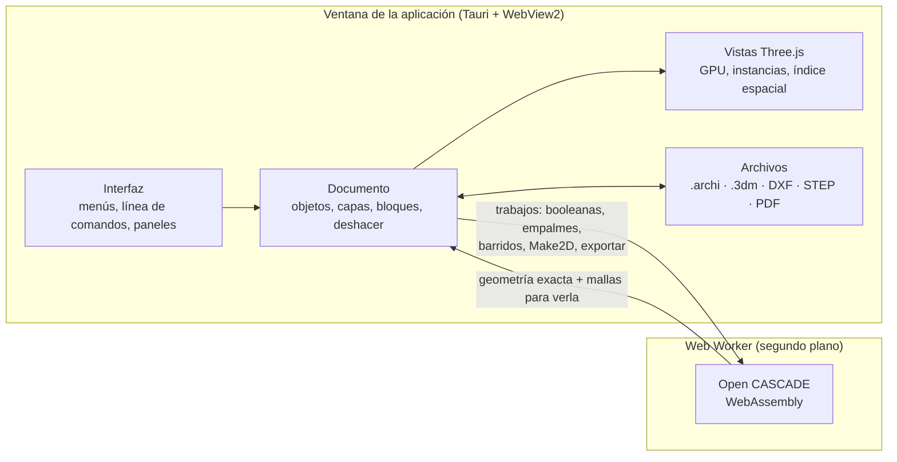

<div align="center">


# ArchiOpen

### Modelador NURBS de código abierto para arquitectura

**Curvas, superficies y sólidos exactos, planos y láminas, render y archivos de Rhino, STEP y DXF,
en una aplicación de escritorio ligera que se maneja con la línea de comandos.**

[](https://github.com/paugavilan8/ArchiOpen/actions/workflows/ci.yml)
[](https://github.com/paugavilan8/ArchiOpen/actions/workflows/desktop.yml)


[](LICENSE)
<br>


[Descargar](#descargar) · [Qué incluye](#que-incluye) · [Funciones](#funciones) ·
[Cómo funciona](#como-funciona) · [Formatos](#formatos) ·
[Hoja de ruta](#hoja-de-ruta) · [Preguntas](#preguntas) · [Desarrollo](#desarrollo)

<br>


</div>

---

ArchiOpen trabaja como los modeladores NURBS profesionales: escribes el nombre de un comando
(`Line`, `Loft`, `BooleanDifference`, `Make2D`…), o lo eliges en un menú o una barra de
herramientas, y el programa te va pidiendo puntos, opciones o distancias. La geometría es exacta:
las curvas son NURBS y las superficies y sólidos son B-rep del núcleo
[Open CASCADE](https://dev.opencascade.org), el mismo tipo de geometría que usan los programas de
CAD industriales, así que lo que se exporta a Rhino o a STEP llega como superficies, no como mallas.

<a id="descargar"></a>

## ⬇️ Descargar

> [!TIP]
> El instalador es un solo archivo y no necesita nada más: la interfaz, el núcleo geométrico y el
> lector de archivos de Rhino van dentro del ejecutable. Ver
> [¿El instalador solo instala un .exe?](#instalador)

Los instaladores se generan en GitHub Actions:

1. Abre el flujo [**Desktop app**](https://github.com/paugavilan8/ArchiOpen/actions/workflows/desktop.yml)
   en la pestaña **Actions**.
2. Pulsa **Run workflow** (o abre la última ejecución terminada).
3. Al acabar, descarga el artefacto de tu sistema, por ejemplo `ArchiOpen-Windows`, que contiene
   el instalador `.msi` y el `.exe`.

Al publicar una etiqueta de versión (`git tag v0.1.0 && git push --tags`) los instaladores también
se adjuntan a un borrador de *release*.

<a id="que-incluye"></a>

## ✨ Qué incluye

<table>
<tr>
<td width="33%" valign="top">

**🧊 Modelado exacto**<br>
Curvas NURBS (también racionales), superficies por barrido, red de curvas, parche y transición,
sólidos con booleanas, empalmes y vaciados, e historial de construcción que rehace las superficies
al editar sus curvas.

</td>
<td width="33%" valign="top">

**📐 Dibujo preciso**<br>
Referencias a objetos (`End`, `Mid`, `Cen`, `Int`, `Perp`, `Tan`…), coordenadas escritas,
ortogonal, planos de construcción y gumball, como en un programa de CAD de escritorio.

</td>
<td width="33%" valign="top">

**📄 Planos**<br>
`Make2D` con líneas ocultas, cotas que se actualizan solas, sombreados, tipos de línea y grosores,
láminas con cajetín y exportación a PDF vectorial y DXF.

</td>
</tr>
<tr>
<td valign="top">

**🎨 Render**<br>
Vista realista con materiales físicos (hormigón, madera, vidrio, metal…), texturas, sol con
sombras y oclusión ambiental, e imágenes de hasta 4K.

</td>
<td valign="top">

**🔁 Compatibilidad**<br>
Abre y exporta `.3dm` de Rhino con superficies exactas, STEP (AP242), DXF de AutoCAD con capas,
bloques y cotas, y STL u OBJ para impresión 3D.

</td>
<td valign="top">

**⚡ Fluido con modelos grandes**<br>
El núcleo calcula en segundo plano (la ventana no se congela y `Esc` lo detiene), la selección
usa un índice espacial y los bloques se dibujan con instancias en la GPU.

</td>
</tr>
</table>

<table>
<tr>
<td width="50%"></td>
<td width="50%"></td>
</tr>
<tr>
<td align="center"><sub>Cuatro vistas, gumball y panel de propiedades</sub></td>
<td align="center"><sub>Lámina A3 con un detalle isométrico de líneas ocultas</sub></td>
</tr>
<tr>
<td colspan="2"></td>
</tr>
<tr>
<td colspan="2" align="center"><sub>Un plano de corte horizontal convierte la vista en una planta en 3D, con las secciones rellenas del color de cada material</sub></td>
</tr>
</table>

<a id="funciones"></a>

## 🧰 Funciones

Haz clic en cada apartado para desplegarlo.

<details>
<summary><b>🖥️&nbsp; Interfaz y vistas</b></summary>
<br>

- Cuatro vistas (Top, Front, Right, Perspective) con rejilla, gizmo de ejes y menú por vista.
- Órbita (botón derecho en Perspective), encuadre (Shift + botón derecho o botón central) y zoom
  con la rueda.
- Visualización:
  - Modos por vista: `Wireframe`, `Shaded`, `Ghosted` (superficies translúcidas) y `X-Ray`
    (las aristas ocultas se ven a través), desde el menú de la vista o con `SetDisplayMode`.
  - `CPlane` cambia el plano de construcción de la vista activa: nuevo origen con un clic,
    `3Point` (origen, eje X y lado del eje Y), `Elevation` (lo sube o baja) y `World`. Lo que se
    dibuja después (rectángulos, círculos, coordenadas escritas…) queda en ese plano.
  - `NamedView` y `NamedCPlane` guardan, recuperan y borran vistas y planos de construcción con
    nombre; la pestaña *Views* los lista y los recupera con un clic. Se guardan en el `.archi`.
- Planos de corte (`ClippingPlane`, menú *View*): se dibuja un rectángulo en el plano de
  construcción de la vista y todo lo que queda delante desaparece, como en una sección o una planta
  en 3D. La flecha indica el lado que se ve; `Flip` le da la vuelta. Los sólidos cortados se
  rellenan del color de su material (o de su capa en las vistas sombreadas). El plano se mueve, gira
  y copia como cualquier objeto, y el corte sigue en directo. Por defecto corta en las cuatro
  vistas: en el panel de propiedades se eligen cuáles, y `EnableClippingPlanes` /
  `DisableClippingPlanes` activan o quitan todos los cortes de la vista activa. Lo cortado no se
  puede seleccionar ni sirve de referencia. Se guardan en el `.archi`; no se exportan, y las
  láminas, `Make2D` y el PDF todavía no los tienen en cuenta.
- Selección por clic, ventana (izquierda a derecha) y captura (derecha a izquierda). El clic, la
  ventana y las referencias a objetos buscan en un índice espacial (un árbol de cajas por
  geometría y otro de objetos), así que siguen siendo inmediatos en modelos de miles de objetos o
  con mallas muy densas.
- Gumball sobre la selección: flechas para mover, arcos para girar (Mayús: pasos de 15°), cajas
  para escalar en un eje (Mayús: uniforme) y centro para mover en el plano. Un clic en una
  flecha, arco o caja sin arrastrar pide el valor exacto.
- Capas con color, visibilidad y bloqueo; panel de propiedades del objeto seleccionado.

</details>

<details>
<summary><b>📐&nbsp; Dibujo de precisión</b></summary>
<br>

- Coordenadas escritas: absolutas `x,y,z`, relativas `r dx,dy`, y longitud fija escribiendo un
  número antes de hacer clic.
- Referencias a objetos (barra de estado; F3 las activa o desactiva todas):
  - `End`, `Mid`, `Cen`, `Quad` y `Near`, las de siempre;
  - `Knot`: los nudos de las curvas NURBS (donde se juntan sus tramos);
  - `Int`: el cruce de dos curvas, aristas o líneas de una malla. Si se cortan de verdad el punto
    es exacto (no el de las líneas con que se dibujan); si solo se cruzan en la vista (una pasa por
    encima de la otra) se toma el punto de la primera;
  - `Perp` y `Tan`: el punto de una curva donde la línea que sale del punto anterior es
    perpendicular o tangente (p. ej. una recta tangente a dos círculos, o la perpendicular a un
    muro), exactos en rectas, arcos, círculos y NURBS.

  Ortho (F8) y forzado a rejilla (F9).
- Arrastrar un objeto o un punto de control seleccionado lo mueve (con referencias a objetos).
- Puntos de control: `PointsOn` (F10) y `PointsOff` (F11) en polilíneas y curvas; se seleccionan,
  arrastran, mueven con el gumball o se borran con Supr.

</details>

<details>
<summary><b>〰️&nbsp; Curvas y puntos</b></summary>
<br>

- Dibujo: `Line`, `Polyline`, `Rectangle`, `Circle`, `Arc`, `Curve` (por puntos de control),
  `InterpCrv` (curva que pasa por los puntos), `Ellipse` (exacta, como curva racional), `Polygon`
  (inscrito o circunscrito, con `NumSides`) y `Helix` (con `Turns`). Las curvas NURBS racionales
  (elipses, cónicas) se leen y escriben exactas en `.3dm`, DXF y el núcleo.
- Transformación: `Move`, `Copy`, `Rotate`, `Scale`, `Mirror`, `Array`, `ArrayPolar`.
- Edición de curvas: `Trim`, `Split`, `Join`, `Explode`, `Offset`, `Fillet` (entre dos líneas),
  `FilletCorners` (todas las esquinas de una polilínea), `Chamfer` (chaflán entre dos líneas con dos
  distancias), `Extend` (alarga curvas hasta otras: rectas en línea recta, arcos siguiendo su
  círculo), `BlendCrv` (curva de transición entre dos extremos con continuidad de posición,
  tangencia o curvatura) y `Rebuild` (rehace una curva con los puntos de control y el grado que
  se pidan, e indica cuánto se separa de la original).
- Puntos: `Point` y `Points` colocan puntos (como los de Rhino: marcas, puntos topográficos);
  `Divide` reparte puntos a lo largo de curvas, en un número de tramos iguales (`Segments`) o cada
  cierta longitud (`Length`). Se mueven, copian y seleccionan como cualquier objeto (con prioridad
  sobre la curva en la que estén), sirven de referencia `End` y se guardan en `.3dm` y DXF
  (`POINT`). `SelPt` los selecciona.

</details>

<details>
<summary><b>🧊&nbsp; Superficies, sólidos e historial</b></summary>
<br>

- Superficies y sólidos (núcleo [Open CASCADE](https://dev.opencascade.org) a través de
  [replicad](https://replicad.xyz), cargado la primera vez que se usa). El núcleo trabaja en
  segundo plano (en un Web Worker): mientras calcula una booleana, un empalme o un Make2D la
  ventana sigue respondiendo, la barra de estado muestra «Computing…» y `Esc` lo detiene.
  Cada operación libera al terminar los objetos de Open CASCADE que ha creado, y las booleanas y
  secciones se vacían antes de borrarse (si no, Open CASCADE perdía unos 160 KB en cada una). Como
  la memoria de WebAssembly nunca encoge, si el núcleo llega a ocupar más de 1 GB (tras importar un
  STEP enorme, por ejemplo) se carga uno nuevo en segundo plano y lo sustituye cuando está libre.
  `Box`, `Cylinder`, `Sphere`, `ExtrudeCrv` (con opción `Solid` para tapar curvas cerradas
  planas), `Revolve`, `Loft`, `PlanarSrf`, `BooleanUnion`, `BooleanDifference`,
  `BooleanIntersection`, `FilletEdge` (elige aristas con clic), `Sweep1` (perfil a lo largo de
  un carril), `Shell` (vaciar un sólido dejando abiertas las caras elegidas), `Section` (curvas de
  corte por un plano vertical dibujado con dos puntos) y `Contour` (cortes a intervalos, p. ej.
  plantas por niveles). `Explode` separa una polisuperficie en caras y `Join` las une de nuevo. Se ven sombreados en Perspective
  (cambia el modo desde el menú de cada vista) y se mueven, giran, escalan y copian como
  cualquier objeto. Alias: `EXT`, `REV`, `BU`, `BD`, `BI`, `FE`, `SW`.
- Superficies avanzadas:
  - `Sweep2`: barre perfiles a lo largo de dos carriles; cada perfil se mueve, gira y escala para
    que sus extremos sigan los carriles, y entre varios perfiles la forma se interpola.
  - `NetworkSrf`: superficie a partir de una red de curvas en dos direcciones (las de cada
    dirección se reconocen solas porque cruzan las de la otra); las exteriores la limitan y las
    interiores le dan forma.
  - `Patch`: superficie ajustada a un contorno cerrado y a las curvas que haya dentro.
  - `EdgeSrf` (de dos, tres o cuatro curvas de borde) y `SrfPt` (de tres o cuatro esquinas).
  - `BlendSrf`: superficie de transición entre aristas de dos superficies, tangente a ambas
    (opción `Bulge`).
  - `Pipe`: tubo a lo largo de curvas, con radio inicial y final (cónico si difieren) y opción
    `Cap` para cerrarlo como sólido.
- Edición de superficies:
  - `Split` y `Trim` también parten y recortan superficies, polisuperficies y sólidos, con curvas
    (que cortan tal como se ven en la vista: una curva dibujada en planta corta todo lo que tiene
    debajo) o con otras superficies y sólidos. En `Trim` se hace clic en la parte que sobra (mejor
    en una vista sombreada). Los sólidos se parten en sólidos.
  - `Cap` tapa los agujeros planos de una polisuperficie abierta y, si queda cerrada, la convierte
    en sólido; `ExtrudeSrf` extruye una superficie en un sólido; `OffsetSrf` desfasa superficies a
    una distancia (opción `Solid` para darles espesor); `ExtractSrf` separa caras elegidas con clic.
  - Curvas sobre superficies: `Project` (a lo largo de la normal del plano de construcción, sobre
    todas las caras donde caen), `Pull` (al punto más cercano), `Intersect` (curvas donde se cortan
    superficies y sólidos), `DupBorder` (bordes abiertos) y `DupEdge` (aristas elegidas).
- Historial de construcción (como `Record History` de Rhino, activo por defecto; botón *History*
  en la barra de estado o menú *Tools*): las superficies y sólidos hechos con `ExtrudeCrv`,
  `Revolve`, `Loft`, `Sweep1`, `Sweep2`, `Pipe`, `PlanarSrf`, `EdgeSrf`, `NetworkSrf` y `Patch`
  recuerdan sus curvas y se rehacen al moverlas, girarlas, escalarlas o editar sus puntos, en el
  mismo paso de deshacer. Editar el resultado a mano o borrar una de sus curvas rompe el historial
  (el objeto se queda como está). `SelChildren`, `SelParents` y `HistoryPurge`; el panel de
  propiedades indica de qué está hecho cada objeto. Se guarda en el `.archi`.

</details>

<details>
<summary><b>🔺&nbsp; Mallas</b></summary>
<br>

- Mallas (como las de STL, OBJ o Rhino: triángulos y cuadriláteros):
  - `Mesh` convierte superficies y sólidos en mallas (opción `Density`: `Coarse`, `Medium` o
    `Fine`), dejando los originales; `MeshBox`, `MeshSphere`, `MeshCylinder` y `MeshPlane` crean
    mallas con el número de caras que se pida (`XFaces`, `AroundFaces`, `VerticalFaces`…).
  - Edición: `Weld` (une vértices cercanos), `Unweld`, `Flip` (invierte las caras),
    `UnifyMeshNormals` (orienta todas las caras igual y, si la malla es cerrada, hacia fuera),
    `FillMeshHoles` (cierra los agujeros, p. ej. de un escaneado), `Join` y `Explode` (en piezas
    sueltas). Se mueven, giran, escalan y simetrizan como cualquier objeto, y con `PointsOn` sus
    vértices se editan como puntos de control.
  - `MeshToNURB` convierte una malla en una polisuperficie de caras planas (un sólido si es
    cerrada), para usarla con las booleanas y el resto de herramientas de sólidos.
  - Se ven suaves en las vistas sombreadas (con aristas vivas donde la malla se dobla mucho); en
    alámbrico se ven todas sus aristas y en sombreado solo los bordes abiertos. El panel de
    propiedades muestra vértices, caras, si es cerrada, área y volumen. `SelMesh` las selecciona.
  - Archivos: `Open` e `Import` leen STL (binario y ASCII) y OBJ (con sus grupos y líneas);
    `ExportSTL` y `ExportOBJ` escriben la selección (o todo lo visible), y las superficies y sólidos
    van como mallas. No tienen unidades: al abrir se toman milímetros y al importar las del modelo.
    En `.3dm` se leen y escriben como mallas de Rhino, en DXF como caras 3D (`3DFACE`) y en STEP
    como caras planas.
  - `Make2D` las dibuja por sus siluetas, pliegues (de más de 40°) y bordes abiertos, ocultas por
    otras mallas y por superficies y sólidos; `Section` y `Contour` también las cortan.

</details>

<details>
<summary><b>📏&nbsp; Análisis</b></summary>
<br>

- Análisis (menú *Analyze*):
  - Medir: `Distance` (con incrementos y ángulos en el plano de construcción), `Length`, `Angle`
    (tres puntos u opción `TwoLines`), `Radius` (radio de círculos y arcos, o de curvatura en el
    punto elegido de una curva), `Area` (curvas cerradas planas, sombreados, superficies, sólidos y
    mallas) y `Volume` (sólidos y mallas cerradas), ambos con su centroide. Las medidas de
    superficies y sólidos son exactas en caras planas, cilíndricas, cónicas, esféricas, tóricas,
    B-splines de grado bajo y extrusiones; en B-splines de grado alto (lofts, tubos cónicos) se
    extrapolan de dos triangulaciones, a una cienmilésima. Las de curvas, a una milmillonésima.
  - `BoundingBox` dibuja la caja que contiene la selección (en coordenadas del mundo o del plano de
    construcción): un sólido, o un rectángulo si todo es plano.
  - `CurvatureGraphOn` / `CurvatureGraphOff`: peine de curvatura sobre curvas (opciones `Scale` y
    `Density`), que se actualiza al editarlas.
  - `Zebra` y `DraftAngleAnalysis` (ángulo de desmoldeo respecto a la normal del plano de
    construcción: verde suficiente, amarillo insuficiente, rojo contrasalida) colorean superficies
    y mallas en todas las vistas; `ZebraOff` / `DraftAngleAnalysisOff` lo quitan.
  - `ShowEdges` resalta los bordes abiertos de superficies y mallas.
  - `What` describe los objetos; `Check` busca problemas (geometría no válida, aristas de más de
    dos caras, caras sin área, curvas sin longitud) e indica si están cerrados; `SelBadObjects`
    selecciona los que tienen problemas.

</details>

<details>
<summary><b>🎨&nbsp; Render y materiales</b></summary>
<br>

- Render:
  - Modo de vista `Rendered` (menú de cada vista o `SetDisplayMode`): materiales físicos con
    reflejos de un entorno de estudio, sol con sombras suaves y sombra sobre un suelo bajo el
    modelo. Las aristas de superficies se ocultan, salvo en lo seleccionado.
  - Materiales: la pestaña *Materials* añade materiales a partir de presets (yeso, hormigón,
    madera, ladrillo, plástico, cerámica, acero, cromo, oro, cobre, vidrio, agua…), los edita
    (color, rugosidad, metal y transparencia) y los asigna a objetos o capas. Sin material, un
    objeto usa el color de su capa. También desde *Properties* (por objeto), el panel de capas y
    `SetObjectMaterial`. Se guardan en el `.archi`.
  - Texturas: cada material puede llevar un patrón generado (`Wood`, `Brick`, `Tiles`, `Concrete`,
    `Marble`) o una imagen de un archivo (JPEG, PNG o WebP; se guarda dentro del `.archi`, reducida a
    1024 px). Se aplican por proyección de caja a su tamaño real en metros (opciones de tamaño, giro
    y relieve), sean cuales sean las unidades del modelo; en los muros el patrón queda derecho. Los
    presets de hormigón, madera, ladrillo, azulejo y mármol ya vienen con su textura.
  - `Sun`: dirección (`Azimuth`, desde el norte), altura e intensidad del sol, fondo (`Studio`,
    `White`, `Sky`) y sombras en el suelo.
  - `Render` dibuja la vista activa a 1280 × 720, 1920 × 1080, 3840 × 2160 o el tamaño de la vista,
    con suavizado y oclusión ambiental, y la muestra en una ventana desde la que se guarda como PNG.
    `ViewCaptureToFile` guarda una imagen de la vista tal como se ve (opciones `Scale` y `Grid`).

</details>

<details>
<summary><b>📄&nbsp; Planos, cotas y láminas</b></summary>
<br>

- Planos 2D: `Make2D` dibuja la selección vista desde una dirección, con eliminación de líneas
  ocultas, como curvas planas en el plano XY (alzados, plantas y axonometrías). Opciones: `View`
  (la vista activa, `Top`, `Front`, `Right`, `Back`, `Left` o `FourView`, que coloca alzado, planta,
  perfil y axonometría en el sistema americano) y `HiddenLines` (dibuja también las ocultas). Las
  líneas visibles van a la capa *Make2D Visible* y las ocultas a *Make2D Hidden*. Las vistas en
  perspectiva se dibujan como proyección paralela.
- Textos y cotas, dibujados como líneas con una tipografía técnica de un solo trazo (Hershey, con
  acentos, ñ, ¿¡, Ø, ±, ° y ²): `Text`, `Dim` (cota horizontal o vertical según hacia dónde se
  arrastre), `DimAligned`, `DimRadius`, `DimDiameter`, `DimAngle` (eligiendo dos líneas o con la
  opción `Points`) y `Leader` (directriz con texto). Opciones `Height` (altura del texto) y
  `Arrow` (flecha o trazo oblicuo de arquitectura). Las cotas se actualizan solas al mover,
  escalar o editar sus puntos (`PointsOn`). En el panel de propiedades se cambian el texto (`<>`
  es el valor medido, p. ej. `L = <> m`), la altura, las flechas y los decimales. `Explode` las
  convierte en líneas; al exportar a `.3dm` o STEP van como líneas.
- Sombreados: `Hatch` (alias `H`) rellena el interior de curvas cerradas planas (las curvas
  dentro de otras son huecos) con un relleno sólido o un patrón: `Lines`, `Cross`, `Grid`, `Brick`
  y `Dashes`, con opciones `Pattern`, `Scale` y `Rotation` (también editables en el panel de
  propiedades).
- Tipos de línea y grosores por capa (en el panel de capas): `Continuous`, `Dashed`, `Hidden`,
  `Center`, `DashDot` y `Dots`, y plumillas de 0,13 a 1 mm. `Make2D` pone las ocultas en
  discontinua.
- Planos: `ExportPDF` (alias `Print`) imprime la vista activa a PDF vectorial con opciones
  `Paper` (A4 a A0, Letter, Tabloid), `Orientation`, `Scale` (p. ej. 1:50, o ajustar al papel),
  `Area` (todo o lo que se ve en la vista) y `Color` (de pantalla o todo en negro). Usa los
  grosores y tipos de línea de cada capa. `ExportDXF` escribe la selección (o todo lo visible) en
  DXF R12, que leen AutoCAD, LibreCAD, Illustrator y casi cualquier programa de CAD: capas con su
  color, tipo de línea y unidades; líneas, polilíneas, círculos y arcos exactos; el resto como
  polilíneas y los sombreados sólidos como relleno.
- Láminas (layouts): `Layout` crea una lámina (A3 apaisado, con una vista en planta ajustada a
  escala y un cajetín) y las pestañas de abajo (*Model*, cada lámina y *+*) cambian entre el modelo
  y las láminas (doble clic en una pestaña para renombrarla). En la lámina:
  - las vistas de detalle se mueven arrastrando, se redimensionan por las esquinas y con Mayús +
    arrastrar se desplaza el modelo dentro; la rueda acerca la lámina;
  - cada detalle tiene vista (planta, alzados, isométricas o la perspectiva actual), escala (1:1 a
    1:10000), modo de dibujo (alámbrico o con líneas ocultas eliminadas, calculadas con el núcleo)
    y un título que se rotula debajo con su escala. Las líneas ocultas solo se recalculan cuando
    cambia lo que el detalle dibuja: un color de capa, un texto, un objeto en una capa oculta o
    mover, escalar o redimensionar el detalle no las rehacen;
  - el cajetín muestra proyecto, plano, número, autor, fecha, escala y número de hoja (1/3…);
  - el papel y la orientación se cambian en el panel y los detalles se recolocan;
  - `ExportPDF` con una lámina abierta imprime esa lámina o todas (opción `Sheets`) en un PDF de
    varias páginas, con los grosores y tipos de línea de cada capa.

</details>

<details>
<summary><b>🧱&nbsp; Bloques, grupos y organización</b></summary>
<br>

- Bloques: `Block` (alias `B`) convierte la selección en un bloque con nombre y punto base;
  `Insert` (alias `I`) coloca copias con escala y giro (en el plano de construcción de la vista);
  `BlockEdit` edita un bloque en su sitio (el resto del modelo se atenúa y no se puede tocar) y al
  terminar (`BlockEditFinish` o el botón *Finish*) se actualizan todas sus copias, también las que
  están dentro de otros bloques; `BlockEditCancel` lo deja como estaba. `Explode` descompone una
  copia en sus objetos y `Purge` borra los bloques sin usar. La pestaña *Blocks* lista los bloques
  con una miniatura y el número de copias, y permite insertar, seleccionar sus copias, renombrar
  (doble clic) y borrar. Se guardan en el `.archi`, se exportan al DXF como bloques e `INSERT`, y
  al abrir o importar un DXF sus bloques se mantienen como bloques (pasados a las unidades del
  modelo; si el nombre ya existe se numera). En `.3dm` y STEP se exportan descompuestos.
  Las copias se dibujan con instancias en la GPU: las superficies y mallas de un bloque se mandan
  una sola vez y cada copia es solo su matriz, así que cientos de copias cuestan casi lo mismo que
  una y no ocupan memoria repetida.
- Grupos: `Group` (alias `G`), `Ungroup` (`UG`), `AddToGroup` y `RemoveFromGroup`. Al hacer clic
  en un objeto agrupado se selecciona el grupo entero, y las copias de un grupo forman su propio
  grupo.
- Organización:
  - `Hide` (Ctrl+H) oculta objetos, `Show` (Ctrl+Alt+H) los vuelve a mostrar seleccionados y
    `HideSwap` intercambia ocultos y visibles; `Isolate` deja solo la selección y `Unisolate`
    devuelve lo que ocultó; `Lock` (Ctrl+L) bloquea objetos (se ven atenuados, sirven de referencia
    pero no se seleccionan) y `Unlock` (Ctrl+Alt+L) los libera. Todo se deshace y se guarda en el
    `.archi`.
  - Selección: `SelCrv`, `SelSrf`, `SelPolysrf`, `SelClosedPolysrf`, `SelOpenPolysrf`,
    `SelBlockInstance`, `SelAnnotation`, `SelDim`, `SelText`, `SelHatch`, `SelLayer` (por nombre
    de capa), `SelDup` (duplicados exactos, dejando sin seleccionar el primero de cada grupo),
    `SelLast` (lo último creado), `SelPrev` (la selección anterior) e `Invert`.

</details>

<details>
<summary><b>💾&nbsp; Archivos: .archi, Rhino, STEP y DXF</b></summary>
<br>

- Archivos `.archi` (JSON) con Abrir/Guardar; la sesión se recupera sola si la app se cierra.
- Archivos de Rhino `.3dm` (con [rhino3dm](https://github.com/mcneel/rhino3dm), MIT):
  - `Open` abre `.archi` o `.3dm`. De un `.3dm` se cargan las curvas (líneas, polilíneas, arcos,
    círculos, NURBS y polycurves), las polisuperficies, superficies y extrusiones (reconstruidas
    como geometría exacta y editable: sólidos cerrados, caras recortadas y agujeros), las capas
    con su color, visibilidad y bloqueo, las mallas y las unidades. Los SubD, textos y bloques aún
    no se cargan y se avisa de cuántos hay.
  - `Save` nunca sobrescribe un `.3dm` abierto (podría perder lo que no se cargó): guarda un `.archi`.
  - `Export` escribe un `.3dm` con las curvas, las mallas, las capas (también las anidadas) y las
    unidades. Las superficies y sólidos van exactos, como polisuperficies de Rhino con sus caras
    recortadas y agujeros: los planos como superficies planas; cilindros, conos, esferas, toros y
    revoluciones como superficies de revolución; las extrusiones de curvas como suma de curva y
    recta; y las NURBS tal cual. Como rhino3dm no sabe construir polisuperficies recortadas, se
    escriben en el formato binario de openNURBS (leído en su código fuente abierto, solo para
    conocer el formato) y rhino3dm las valida antes de guardarlas. Lo que no tiene equivalente
    exacto (p. ej. superficies desplazadas) va como malla y el mensaje lo dice.
  - `Import` añade un `.3dm` al modelo actual, escalándolo a sus unidades.
  - `Units` cambia las unidades del modelo (sin escalar la geometría).
- Archivos STEP (`.step`, `.stp`, AP242), el formato que leen casi todos los programas de CAD:
  - `ExportSTEP` escribe la selección (o todo lo visible) con geometría exacta: sólidos y
    superficies como B-rep y curvas como curvas, con el nombre y el color de su capa y las
    unidades del modelo.
  - `ImportSTEP` añade los sólidos, superficies y curvas de un STEP a la capa actual, convertidos
    a las unidades del modelo. Líneas, círculos y arcos llegan exactos; otras curvas, ajustadas.
- Abrir e importar DXF (ASCII, de R12 a 2018): `Open` abre un `.dxf` como modelo nuevo e `Import`
  lo añade al actual, convertido a sus unidades. Se leen:
  - las capas con su color (también color verdadero), tipo de línea, grosor, apagadas y
    bloqueadas, y las unidades (`$INSUNITS`; sin unidades se toman milímetros o las del modelo);
  - líneas, polilíneas con arcos, círculos y arcos (también en planos inclinados), elipses,
    splines, caras 3D y `SOLID`;
  - textos y textos de varias líneas (sin formato, con `%%c`, `%%d`, `%%p` y acentos);
  - cotas lineales, alineadas, de radio, diámetro y ángulo, que se convierten en cotas de
    ArchiOpen que siguen midiendo;
  - directrices, sombreados (con huecos; los patrones de AutoCAD se aproximan con los de
    ArchiOpen) y bloques, que siguen siendo bloques (con escala, giro, matrices y bloques
    anidados).
  - Multilíneas, multidirectrices, sólidos ACIS, imágenes y tablas aún no se cargan y se
    avisa de cuántos hay. Los DXF binarios y los DWG no se leen: guárdalos como DXF ASCII desde
    el programa de origen (o conviértelos con ODA File Converter, gratuito). Las caras 3D
    (`3DFACE`) se juntan en una malla por capa.

</details>

<details>
<summary><b>⌨️&nbsp; Otros comandos y alias</b></summary>
<br>

- Otros: `PointsOn`, `PointsOff`, `Delete`, `SelAll`, `SelNone`, `Undo`, `Redo`, `Zoom`, `MaxViewport`, `Snap`, `Ortho`,
  `Osnap`, `Units`, `New`, `Open`, `Save`, `SaveAs`, `Import`, `Export`, `ImportSTEP`,
  `ExportSTEP`.
- Alias: `M`, `RO`, `SC`, `MI`, `AR`, `AP`, `TR`, `J`, `X`, `OF`, `F`, `REC`, `A`, `U`, `Z`, `ZE`,
  `ZEA`, `ZS`, `EXT`, `REV`, `BU`, `BD`, `BI`, `FE`.

</details>

<a id="como-funciona"></a>

## ⚙️ Cómo funciona



- **Comandos.** Cada comando es una pequeña función asíncrona que pide puntos, objetos u opciones
  y modifica el documento. Todo lo que hace se deshace en un paso.
- **Documento.** Las curvas son NURBS calculadas en TypeScript. Las superficies y sólidos se
  guardan en el formato exacto de Open CASCADE, junto con una malla que solo sirve para verlos.
- **Núcleo en segundo plano.** Las operaciones pesadas se mandan a un Web Worker con Open CASCADE
  compilado a WebAssembly: la ventana sigue respondiendo mientras calcula y `Esc` lo detiene.
  Cada operación libera la memoria que ha usado, y si el núcleo crece demasiado se sustituye por
  uno nuevo sin que se note.
- **Vistas.** Three.js dibuja en la GPU. Un árbol de cajas por objeto hace que el clic, la
  selección por ventana y las referencias a objetos solo miren lo que está cerca del cursor.
- **Aplicación de escritorio.** [Tauri](https://tauri.app) empaqueta todo en un ejecutable nativo
  que usa el motor web del sistema (WebView2 en Windows), por eso ocupa decenas de megas y no
  cientos.

<a id="formatos"></a>

## 📁 Formatos de archivo

| Formato | Abrir / importar | Guardar / exportar | Notas |
| --- | :---: | :---: | --- |
| `.archi` | ✅ | ✅ | Formato propio (JSON): todo el modelo, láminas, materiales e historial |
| Rhino `.3dm` | ✅ | ✅ | Superficies y sólidos exactos en los dos sentidos; SubD, textos y bloques aún no se leen |
| STEP `.step` `.stp` | ✅ | ✅ | AP242, B-rep exacto, con capas, colores y unidades |
| DXF | ✅ | ✅ | ASCII R12–2018: capas, bloques, cotas, textos, sombreados |
| STL / OBJ | ✅ | ✅ | Mallas; las superficies se exportan trianguladas |
| PDF | — | ✅ | Vectorial, con grosores y tipos de línea; láminas en varias páginas |
| PNG | — | ✅ | `Render` y `ViewCaptureToFile` |

<a id="hoja-de-ruta"></a>

## 🗺️ Hoja de ruta

- [x] Referencias `Int`, `Perp`, `Tan` y `Knot`
- [x] Planos de corte en vivo (`ClippingPlane`) con secciones rellenas
- [ ] Planos de corte en las láminas, `Make2D` y el PDF
- [ ] `Orient`, `Orient3Pt`, `Align` y `Distribute`
- [ ] Leer textos y bloques de `.3dm` y exportar bloques como bloques
- [ ] Copiar y pegar entre archivos
- [ ] Superficies: `FilletSrf`, `ChamferEdge`, `MatchSrf`, `RailRevolve`, `Untrim`, `UnrollSrf`
- [ ] Deformaciones: `Bend`, `Twist`, `Taper`, `Flow`, `Cage`
- [ ] Modelado SubD
- [ ] Herramientas de arquitectura: muros, forjados, huecos y niveles
- [ ] Instaladores firmados y actualizaciones automáticas

<a id="preguntas"></a>

## ❓ Preguntas frecuentes

<details id="instalador">
<summary><b>¿El instalador solo instala un .exe? ¿No faltan archivos?</b></summary>
<br>

No falta nada. Tauri mete dentro del ejecutable la interfaz, el núcleo Open CASCADE (unos 23 MB
de WebAssembly) y el lector de `.3dm`. Lo único que usa de fuera es el motor web del sistema:
WebView2 en Windows 10 y 11, que ya viene instalado (si faltara, el instalador lo descarga). Tus
modelos son los `.archi` que guardes donde quieras.

</details>

<details>
<summary><b>Windows no me deja abrir el programa</b></summary>
<br>

El ejecutable todavía no está firmado. En casa, Windows SmartScreen puede avisar: pulsa *Más
información* → *Ejecutar de todas formas*. En ordenadores de empresa, las políticas (AppLocker)
suelen bloquear programas sin firmar instalados en la carpeta del usuario; ahí hace falta que lo
autorice el administrador.

</details>

<details>
<summary><b>¿Puedo abrir mis archivos de Rhino y volver a Rhino?</b></summary>
<br>

Sí. `Open` e `Import` leen `.3dm` con curvas, superficies, polisuperficies, extrusiones, mallas y
capas, y `Export` escribe un `.3dm` con las superficies y sólidos exactos (no como mallas). Lo que
aún no se lee (SubD, textos, bloques) se avisa al abrir, y `Save` nunca sobrescribe el `.3dm`
original.

</details>

<details>
<summary><b>¿Necesita internet?</b></summary>
<br>

No. Todo funciona sin conexión; no hay cuentas ni telemetría.

</details>

<details>
<summary><b>¿Está relacionado con Rhino o McNeel?</b></summary>
<br>

No. ArchiOpen es un proyecto independiente. Sigue la forma de trabajar y los nombres de comandos
habituales en los modeladores NURBS para que resulte familiar, pero no usa código, iconos ni
recursos de ningún otro programa. Los `.3dm` se leen con [rhino3dm](https://github.com/mcneel/rhino3dm)
(MIT) y se escriben siguiendo el formato documentado en el código abierto de openNURBS.

</details>

<a id="desarrollo"></a>

## 🛠️ Desarrollo

Requisitos: Node 22 y, para la app de escritorio, Rust y las
[dependencias de Tauri](https://tauri.app/start/prerequisites/) de tu sistema.

```sh
npm install
npm run dev        # interfaz en el navegador, http://localhost:5173
npm run app:dev    # aplicación de escritorio con recarga en caliente
npm run app:build  # instaladores en src-tauri/target/release/bundle
npm run typecheck
npm test           # pruebas de la geometría y el núcleo
```

<details>
<summary><b>Estructura del código</b></summary>
<br>

| Carpeta | Qué hay |
| --- | --- |
| `src/core` | Documento, geometría (curvas, mallas, cotas, sombreados, bloques), índice de selección, referencias a objetos |
| `src/math` | NURBS: evaluación, nudos, pesos |
| `src/kernel` | Open CASCADE: carga, Web Worker, trabajos, memoria, exportación exacta a `.3dm` |
| `src/commands` | Los comandos, agrupados por tema |
| `src/input` | Ratón, teclado, peticiones de puntos y referencias a objetos |
| `src/view` | Vistas Three.js, gumball, modos de visualización, render |
| `src/io` | `.archi`, `.3dm`, DXF, STEP, STL, OBJ, PDF y láminas |
| `src/ui` | Menús, barras, paneles y línea de comandos |
| `src-tauri` | Aplicación de escritorio |

</details>

<a id="creditos"></a>

## 🙏 Créditos

- [Open CASCADE Technology](https://dev.opencascade.org) (LGPL 2.1 con excepción) a través de
  [replicad](https://replicad.xyz) (MIT), [Three.js](https://threejs.org) (MIT),
  [rhino3dm](https://github.com/mcneel/rhino3dm) (MIT) y [Tauri](https://tauri.app) (MIT/Apache 2.0).
- El archivo de prueba `src/io/fixtures/ezdxf-sample.dxf` está generado con
  [ezdxf](https://github.com/mozman/ezdxf) (MIT).
- Tipografía de los textos: fuentes Hershey (A. V. Hershey, U.S. National Bureau of Standards), en
  la conversión de [hersheytext](https://github.com/techninja/hersheytextjs) (MIT).

## 📜 Licencia

[MIT](LICENSE): puedes usar, copiar, modificar y distribuir ArchiOpen, también en otros proyectos,
siempre que mantengas el aviso de copyright y la licencia. Las bibliotecas que usa conservan sus
propias licencias (ver [Créditos](#creditos)).
